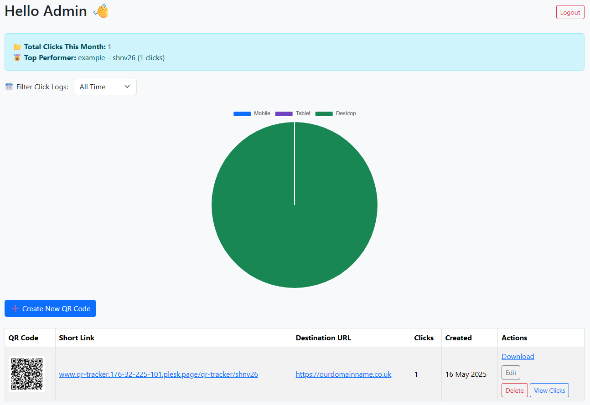

# QR Tracker – Self-Hosted QR Code Generator & Tracker

This is a fully self-hosted QR code tracking tool built by [Gary Pratten](https://www.my-local-trades.co.uk/) for tradespeople, business owners, and ToolBox members. No subscriptions, no third-party platforms, no limits — **you own it, you host it**.

## 💡 What It Does

- ✅ Create **unlimited QR codes**
- ✅ Each with its own **short link**
- ✅ Track **unlimited scans** (IP, timestamp, device type)
- ✅ Filter scans by **last 7 days**, **30 days**, or **all time**
- ✅ View analytics in a clean, easy-to-use dashboard
- ✅ Export scan data to **CSV**
- ✅ Edit or delete QR codes anytime
- ✅ Everything runs from your own server/subdirectory (e.g. `yourwebsite.com/qr-tracker`)
- ✅ Fully private – **no data shared externally**

## 📸 Screenshot



## ⚙️ Installation

1. Upload the files to your server in a subdirectory (`/qr-tracker` or similar).
2. Visit `yourdomain.com/qr-tracker/install.php`.
3. Fill out your database connection details and admin email/password.
4. Hit "Install" and you're ready to go! 🎉
5. Visit `login.php` to log in and start creating QR codes.

📄 Full setup walkthrough: `instructions.php` included in the repo.

## 🧠 Why I Built This

Most QR tracking platforms (like Hovercode, Beaconstac etc.) charge £15+ per month and limit how many QR codes, scans, or features you can use.

That’s no good for tradespeople and local business owners who just want something **simple, useful, and private** — so I built this.

No branding. No limits. No fees. Just a great tool you can actually own.

## 📁 Folder Structure

```
qr-tracker/
├── assets/
│   ├── qr/                  # Generated QR code images
│   ├── css/                 # Custom styles (optional)
│   └── js/                  # Custom scripts (optional)
├── includes/
│   ├── db.php               # Database connection file
│   └── phpqrcode/           # PHP QR code library
├── templates/
│   ├── header.php
│   └── footer.php
├── create.php
├── dashboard.php
├── delete.php
├── edit.php
├── export_clicks.php
├── index.php
├── install.php
├── instructions.php
├── login.php
├── logout.php
└── config.php               # (Auto-created during install)
```

## 📜 License

This project is licensed under the **MIT License** – see the `LICENSE` file for details.  
Use it freely, modify it, share it – just don’t sell it without asking 😉

## 🤝 Support

Questions or need help getting it set up?  
Send me a message or visit [my-local-trades.co.uk](https://www.my-local-trades.co.uk/)  
I’m always happy to help fellow ToolBox members and small business owners 💪

---

**Built with ❤️ by Gary Pratten**
